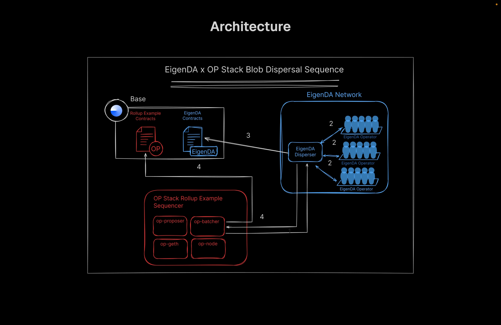
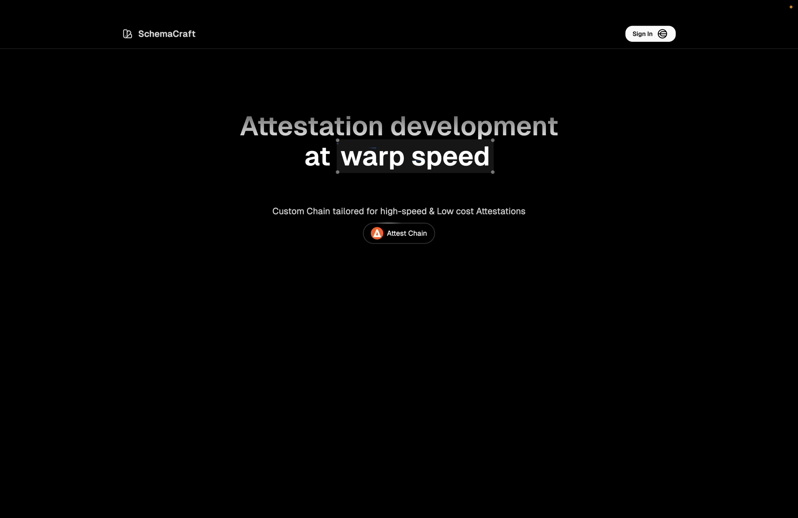
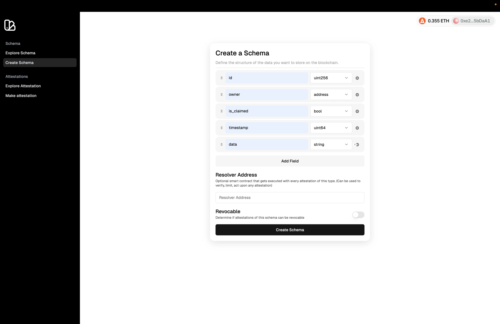
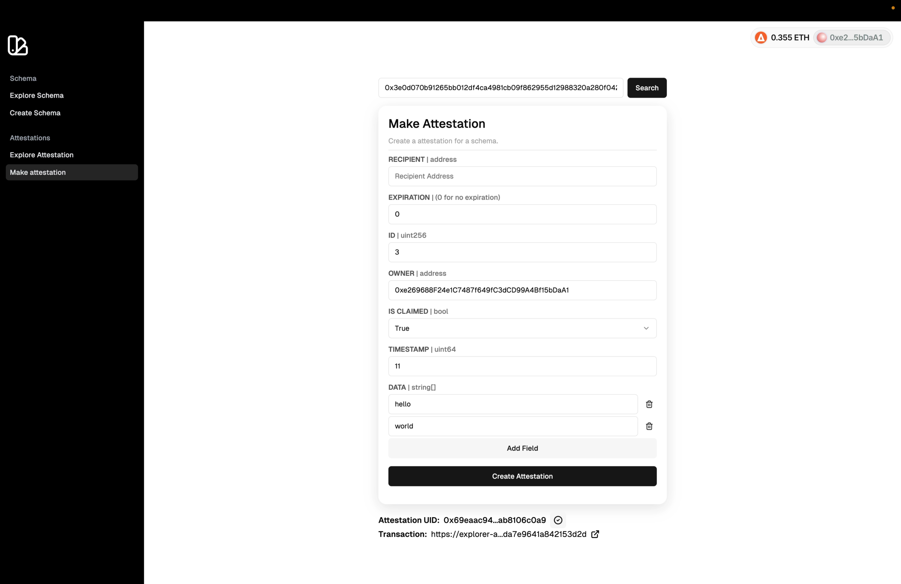
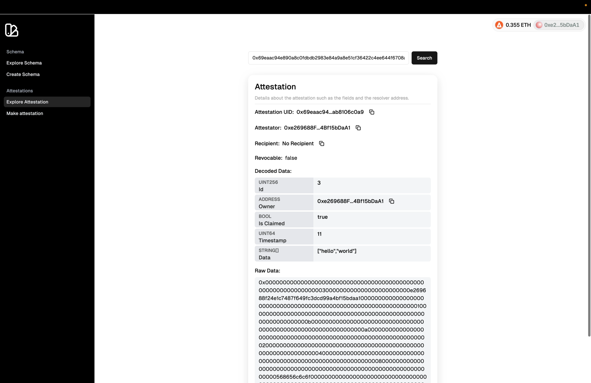
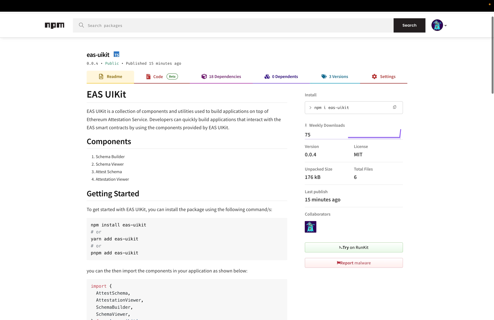

<p align="center">
</p>

SchemaCraft is an Attestation Developer Tool for Ethereum Attestation Service. The project consists of two parts:

1. **Attest Chain** - A L3 Chain tailored specifically for attestations. It is built using OP Stack with EigenDA, deployed using Conduit. It uses Base Sepolia as a L2 Chain.
2. **EAS UIKit** - A developer tool in form of a npm component library which has various components like Schema Builder, Schema Viewer, Attestation Requester, Attestation Viewer, etc.

## Architecture 🏗️



## How it works 🛠️

### Attest Chain

The Custom Attest Chain is deployed using Conduit and is built on OP Stack with EigenDA.

The main modification are in sequencer nodes, where the batches of transactions are posted to DA and state roots of executed transactions are sent to the DA.

When transaction is written to Eigen DA the disperser return as unique blob key which can be used to later retrieve the data

We also have deployed EAS Contract on Attest chain on the following addresses

```bash
EAS=0xe86b1899376c77e1a109eA2124E462EF58E56897
SchemaRegistry=0x8f966BC6Ad2D241a01C1f7634C47c7419Ce96830
Indexer=0xA787c2162F60559eC602C33b5720e51ec19bfF5F
EIP712Proxy=0x2Df018Bf17f31e81a0677C77Fa90A23f9FceCF59
```

Also the custom chain comes with an open source Blockscout explorer.

Block Explorer: https://explorer-attest-chain-52s82yu298.t.conduit.xyz

---

### Virtual Testnet

The Virtual Testnet is deployed using Tenderly and is used for testing the Attest Chain. It is based on Base Sepolia and EAS Contracts are deployed on the Virtual Testnet.

Block Explorer: https://virtual.base.rpc.tenderly.co/1f98648a-38db-493e-9560-f23a8254c17d

---

### EAS UIKit

EAS UIKit is a collection of components and utilities used to build applications on top of Ethereum Attestation Service. Developers can quickly build applications that interact with the EAS smart contracts by using the components provided by EAS UIKit.

https://www.npmjs.com/package/eas-uikit

To get started with EAS UIKit, you can install the package using the following command/s:

```bash
npm install eas-uikit
# or
yarn add eas-uikit
# or
pnpm add eas-uikit
```

```tsx
<SchemaBuilder
  registryAddress='0x0a7E2Ff54e76B8E6659aedc9103FB21c038050D0' // Sepolia Schema Registry Address
  onSuccess={(uid) => console.log('Schema created with uid:', uid)}
/>
```

```tsx
<AttestSchema
  schemaUID='0xa1d848a3e4fc480df46ab83f0708ff436a8cc2e5d33ae96b10dba43f3ddc6b7c'
  easContractAddress='0xC2679fBD37d54388Ce493F1DB75320D236e1815e' // Sepolia EAS Contract Address
  registryAddress='0x0a7E2Ff54e76B8E6659aedc9103FB21c038050D0' // Sepolia Schema Registry Address
  signer={signer}
/>
```

Full Documentation can be found [here](./packages/eas-uikit/README.md)

---

### World ID

The application uses World ID to gate access to verified users with `Device` type or `Orb` level verification.

The verification is done using Incognito Action and verified using Cloud Verification. This returns `merkle_root`, `nullifier_hash` and `proof`

The Proofs along with nullifier hash are stored in session cookies with checks ensuring that proofs are valid.

## Demo Video 🎥

https://stream.mux.com/dEIk6ycEm02Didw7eMW01wKH02R7rhj37mqRg01RELiStL00/high.mp4

## Screenshots 📸

<table>
  <tr>
    <td valign="top" width="50%">
      <br>
      
    </td>
    <td valign="top" width="50%">
      <br>
      
    </td>
  </tr>
</table>

<table>
  <tr>
    <td valign="top" width="50%">
      <br>
            
    </td>
    <td valign="top" width="50%">
      <br>
            
    </td>
  </tr>
</table>

<table>
  <tr>
    <td valign="top" width="50%">
      <br>
            
    </td>
    <td valign="top" width="50%">
      <br>
            
    </td>
  </tr>
</table>

## 🧑🏼‍💻 Tech Stack

- **Frontend**: Next.js, Tailwind CSS, shadcn
- **Integration**: `@worldcoin/idkit`, `wagmi`, Conduit, Tenderly, `eas-sdk`
- **Contracts**: `Ethereum Attestation Service`

## Get Started 🚀

The following repository is a turborepo and divided into the following:

- **apps/www** - The web application built using NextJS.

First install the dependencies by running the following:

```

pnpm install

```

Then fill in the Environment variables in `apps/www/.env.local`

```bash
NEXT_PUBLIC_WALLETCONNECT_ID="your_wallet_connect_id"
NEXT_PUBLIC_ATTEST_CHAIN_TESTNET_RPC_URL="tenderly_virtual_base_rpc"
NEXT_PUBLIC_ATTEST_CHAIN_TESTNET_BLOCK_EXPLORER_URL="tenderly_virtual_base_block_explorer"

NEXT_PUBLIC_ATTEST_CHAIN_RPC_URL="https://rpc-attest-chain-52s82yu298.t.conduit.xyz"
NEXT_PUBLIC_ATTEST_CHAIN_WSS="wss://rpc-attest-chain-52s82yu298.t.conduit.xyz"
NEXT_PUBLIC_ATTEST_CHAIN_BLOCK_EXPLORER_URL="https://explorer-attest-chain-52s82yu298.t.conduit.xyz"

NEXT_PUBLIC_WORLDCOIN_CLIENT_ID="your_worldcoin_client_id"

IRON_SESSION_PASSWORD="your_secured_session_password"
```

Then run the following command to start the application:

```bash
pnpm dev
```

---
